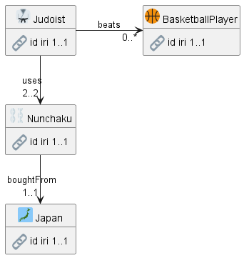

# soml2puml
Generate nice PlantUML diagrams from SOML schemas.

<!-- markdown-toc start - Don't edit this section. Run M-x markdown-toc-refresh-toc -->
**Table of Contents**

- [soml2puml](#soml2puml)
    - [Example Diagrams](#example-diagrams)
        - [Dynamic Diagram](#dynamic-diagram)
        - [Overview Diagram](#overview-diagram)
        - [Full Diagram](#full-diagram)
    - [soml2puml Invocation](#soml2puml-invocation)
        - [Print Encoded URL](#print-encoded-url)
        - [soml2puml Limitations](#soml2puml-limitations)
    - [SOML Additions](#soml-additions)
        - [At Schema Level](#at-schema-level)
        - [At Object Level](#at-object-level)

<!-- markdown-toc end -->


## Example Diagrams

SOML is a simple object model implemented as a GraphQL schema over an RDF repository.
Diagrams are very useful to explain a data model.
Here we give examples of 3 kinds of diagrams for the SOML schema of buildingSMART Data Dictionary (bSDD) at https://bsdd.ontotext.com/ .

### Dynamic Diagram

[GraphQL Voyager](https://ivangoncharov.github.io/graphql-voyager/) (see [source](https://github.com/IvanGoncharov/graphql-voyager)) is a visual app that uses GraphQL Schema Introspection to explore a GraphQL endpoint and displays the schema of the endpoint, 
allowing the user to search and browse the available types and queries.

The web page [bsdd-graphql-voyager-refact.html](https://rawgit2.com/Accord-Project/bsdd/main/bsdd-graphql-voyager-refact.html) shows a Dynamic Voyager Diagram of the bSDD schema.
There are two modes:

- Overview (uncheck "Show leaf fields")


- Full view


Pros:
- Has Overview and Full modes
- Allows to order fields as defined in the schema, or alphabetically
- Embeds searchable schema documentation
- Always in sync since it's generated from the GraphQL schema
- SVG so the user can zoom as much as needed

Cons:
- Shows two "parasitic" nodes `Query` and `Object` that are highly connected and overload the diagram.
  Once the user knows they can query for any object, thse nodes don't need to be displayed.
  TODO: customize Voyager to remove these nodes.
- Doesn't visualize objects and attribute types with an icon (emoji)
- Doesn't show mandatory status (TODO why `!` is shown only on `Query`?)
- Doesn't show exact relation cardinalities, e.g. 
  `ClassificationRelation, PropertyRelation` have exactly 2 incoming links
- No way to control the position of nodes. Eg `Domain` should come before `Classification`
- Doesn't show relation names until the user hovers: not good for printing

### Overview Diagram

This diagram is generated with [PlantUML](https://plantuml.com/) and omits the attributes.


Pros and features:
- Uses `hide empty members, hide circle` to hide useless node compartments
- Uses `left to right direction` to fit more.
  Note: in this mode, PlantUML arrow direction is changed as follows:
  - `--` or `-->` or `down` (default): goes to the right
  - `->` or `right`: goes down
- Uses `skinparam nodesep 50` to allow fitting two relations and two cardinalities on one edge, when the nodes are one above the other
- Uses object characteristic `diagram.emoji` to visualize classes
- Uses object characteristic `diagram.rank` to order classes:
  smaller rank go to the left, difference less than 1 goes down
- Collects `inverseOf, inverseAlias` relation pairs into one edge
- Shows exact relation cardinalities from SOML, e.g. `0..1, 0..*, 1..1, 1..*, 2..2` etc

### Full Diagram

This uses the same layout as the Overview diagram, but adds attributes.


Additional features:
- Recognizes attributes as `range` that starts with lowercase and doesn't include `:`
  (e.g. range `Foo` is a class, and `foo:Bar` is a namespaced class)
- Uses emoji to visualize attribute datatypes. All enumerations (found in SOML section `types`) are visualized as `book`
- Works even if there are no attributes for a particular class
- Uses PlantUML [creole table](https://plantuml.com/creole#51c45b795d5d18a3) with transparent border and background to line up nicely emoji, attribute, datatype, cardinality
- Displays exact attribute cardinalities from SOML
- Orders attributes alphabetically

## soml2puml Invocation

Take a SOML schema (with diagram-related additions, see below) and print a PlantUML diagram on STDOUT
```
perl soml2puml.pl -overview < schema.yaml > schema-diagram-overview.puml
perl soml2puml.pl           < schema.yaml > schema-diagram.puml
```

### Print Encoded URL
The PlantUML Server uses URLs that encode the diagram text, see [text-encoding](https://plantuml.com/text-encoding).
- E.g. [this URL](https://www.plantuml.com/plantuml/uml/xLbBR-Cs4BxhLmZkhUW6STfUZ230mac1eDaapSRjfO11YIEB3KMg99LOgFU_ToZ9ZlKqxQJxAEA3OL4pcjV7cOzMp2ZuaAGcznD80b3QY-rIo5J8mUCG6Tz8Nx55R7pA58I6IU7f1oPIeaZY2qb1G-h_VEnv8ITQ-wFJ2H1buZb9GB6GwCcPFvMPC2eV-KIlV_l_UAVV6KM4nWU1C3ziNvojJYSwPOhmkP06Ka8dPwiGJQryRHGJYvK_FZeQhxmkEO66ctAVdfqBf7omFjr116WhX7CPPWaQBRnhhUxqCoGS12KABLDYqBBzlcVMX_ryx98ppF2XO1PS1Z1_OfXkcstAq3MCxOg8HKOMK8IqljW_uqpBLqewhbilE55pbN70PFapmSgKsn-V5mrTSZfF0icV9O-R8N0I04U_psL2c2WyBtyUudkQ5rlgMXeMGjDebmglYZZj3diBXEYlcQKMX7HcGZSuSlH2Q3T7Ij6PuYxIYLHmAIBfADvJhAte570W6iuREwt_aTeGasaNuu_O_R2v3Q0uOXpcaUIq0F3KBhC8MvpjYMLlgotjqpe8DjR7Gik6rbSusxiiVcfcxlCKPQOTQ_snkkwUi6pMDz4DufK9bpHkL6ODG7tV8w-06AckEW5-t0412k-7ajNl6OM8OQ-frNX8EiLnLrYvMAQu_uYpPZKwDhFa1T1loQdrGtiIrQ70RI-uZC8BWUCalwuPwg-B0Wmw17eJ_8LJlsLjK0k51jLg6_gHwHsL79_y-DEMw7LccShAPyBii_C7UdyMK5O-sncsEXTIv8cBQCReCAAhpkEGWagoEmES2TiTC92Cy3iBNuqeB60xKmobxLThhZrPDCNOpswLJ46PagMjBrw_XxsW5mc1a0AwziqLarzD4sjt2c98sQg_xOO7EbGiTHP7juNk5gvmlX5vdzXAt4GVim3tSz5Bww1lAbnmn0YUEwQPiX3T9Nu5Oc7YdL9PmeJCzAKmTi7aknG-uERQ9NCVWqeapR7pi_0U3s6Wi66fdH6MLT_H_0wQGPKlj_Pa1mRKzaRJBji0bYH9UPUjW70kpJoGo_Aq4iOGFXH7ZFFIwCf7SeFSJcor0B0SUQvJ-G1qZhGMJpZQAYLaUR4CUQRPesM14BA4y2rZ0tgNOa2lJL_1n9BUH1-GSs9baW9GhTXwpJ5nc9jCxEUcAtT8YK4ZJdiqZNEDN9B_bf62DNILj2IZQGMItmdFu5ScSDRTjfU6-4cJP-W3YOR-ffY6TXuk1fRc5waIObmgryqssc8u68RpzKLPIQcrGTAT9R7hKrPpSVy3kAeqwxDttED4_MXLSwNxrd_cK4oI1DIS23hVqBQw2pKIrtthgw9qRypiZPczCRCNCRClGCpwbUxWxumfe5jQ3gR-KCoGmFhNrdeZWLyp2MphOF5jSmDQi3ytbHBC7y5yJfhvzdVMpjSVhcnq_3zdeoK6wu2hKT5YPN_Q5sXA9u_rVUBAgWuT-bMMj5Ic8qMVFAzwgzNr6LddHlux-kxC7zagZPglFBO_4x_-ek9FuTFYsTw0qhC9lzl4XiPscLZVH5Fr6uCcIpCRa-CTKPK5dJPZ2sF6wTJTwidHqGbQLNs1RauJfTNr4G4jLN_fUxLKT7wsArN7QYCcEvgVgfuzzDndhrlFhVdh7-JrgnL_FIsy0VMNfEXV) shows the SVG version of the diagram above.
- Change `svg` to `uml` to see the PlantUML editor

SOML now includes keys at schema level (`diagram.full, diagram.overview`: see below) 
where you can put these URLs.

I wanted to use perl module [UML::PlantUML::Encoder](https://metacpan.org/pod/UML::PlantUML::Encoder) in the script to
print on STDERR the PlantUML Server URL of the diagram for inclusion in SOML.
But due to [bug 148220](https://rt.cpan.org/Ticket/Display.html?id=148220) I now do this using PlantUML itself

Take a look at [Makefile](img/Makefile) for some examples:
```Makefile
%-diagram.puml: %.yaml
	perl ../soml2puml.pl < $^ > $@
	@echo -n full: http://www.plantuml.com/plantuml/svg/
	@puml -encodeurl $@
```

`puml` is a simple script:
```sh
#!/bin/sh
java -jar c:/prog/plantuml/plantuml.jar -charset UTF-8 $*
```

### soml2puml Limitations
- Doesn't use SOML `properties`, i.e. assumes that `props` are fully expanded
  This is best handled on the Ontotext Platform side: it needs to have a call to serve a schema where:
  - `props` are fully expanded
  - The following are omitted for brevity, so as not to overload ChatGPT: `label`, `properties`, `rbac`
- Handle superclasses by:
  - Using an inheritance arrow `--|>`
  - Not assuming that inverse relations connect exact classes (they may connect a superclass on one side)

## SOML Additions

The following diagram-related additions to SOML are proposed.

### At Schema Level

3 URLs that capture the 3 kinds of diagrams.

```yaml
id: /soml/bsdd
label: SOML schema for buildingSMART Data Dictionary (bSDD)
diagram:
  dynamic: https://rawgit2.com/Accord-Project/bsdd/main/bsdd-graphql-voyager-refact.html
  overview: http://www.plantuml.com/plantuml/svg/fLF1Qjmm4BtxAuIFXJL9Zai9WUROGmcqfuAPbSPhaP5anZ9B_hwMNTKxQvijH2VjctdlpTEEN_e870T7HMiDAdHT_50EtGcvdo5jMHCMX4rKCIYsvpOgOnbrjC4NXIReUrL-FJQMi6u26UJZi_gMODjO3QcjLD3VG0kn1UUGQ_2clZ1wtQxeFpXqoF53oCZI8aVMlwyKtf3MWyZIee30iQt18OyjVT8AWuyysUVxbH-SaCQcr-30pWRpTMavKpXXVR6ZQX8r5doI_Gx-FC0P9qx-iR3-FOQ8lniu5qHK0OgGlUP0TCNx1JHW8abaOPn2U4zZls63QJHy3Nfmw6CYhT656DccS0HSyq3JUlpqTgQbIo7_47LzoeUg-bAgms6yFbRLO_dtSTNMEIep5NzxfONa_peyJ0wxpScX0qOVPKloQoqPYHRRcxgETTzKh-osFuBjpLuvFbNLqnr7JbmqenNdrH41nCaPHl7iivTTnX75qQlBGJ8c8gYT87Am-q7sPyldS7ZEFk9Zk1K7ed11CzLstkVJiY_epU3e3m00
  full: http://www.plantuml.com/plantuml/svg/xLXVRnD747_tfpYbRrM94jed2o5GaafHWT2Gj2-LhBdTiM_A_hdEpeLOTRzxRsqMSdWvBo55eEQUpdk_t_oPdPsTyPCWmD9PCsb8OuMsbMLbqTR8OREaY9N1YS6vLE8hfaKZbIP69UJTH1a8eTfxD9sJmTdS6uqyVLmTnMMQauA8sgiWVB1K_Jrvz9qmkD02evCVRlvul7eqLM3GQUY5hK09NQrPno1uAMfLQH2y88khwd1__t0rwGcrzwzxi1gekLYsFUOeitQGUA4b1ZDpNh057ILutNyFmkGMINuUrpdXvTdyZ6b1xZtbO3VbCk00__r7y8mWdf-1MtImm2ElSKlD85GQduu4QyGoZNDo56abVcXi6JVHFBbk3JWePdhLMNHoZdDaT0fBI0viqOvm4feFL8vWG52VpjM94vBb2x15-yBO6b2ep-e_KKdKLixgGIEqmMuoNb7OiPE73t_ywGRqHHVFxgeY9sEE1m7fGabCGrThsiWkJjkmTDujRGcq8psUqLV8PI58o7m43BdN4KEX0tCUqpUWatNQNZBrQAQ4_cVolgerO2to39oUlOcPrMpLjfViMsHPPcfS-dIdjUxRhrbvcWQ1M9c_zVg6GJ6rnN2ow48U7DFw9kIfZJjnDd_LrK70AHpaU8PmOb09aphgE6RQBlWpT0jfTg8wIyvtuTH9N93bBi9p264Nvg91jbul7LXI5sXRP92ESIUFRCBSyPNprfQNm61HaDDPBgtrU0ssDJbLDHZZPLRxwzaRacQc6bInD54utkXSLRNt1i6bWpnAEiU_EcBKxrX5gdvd4gWDvbWOMxnPQFrhr3C8WamXiYnSdrmhqmMwwdaQ5LamPRnJb-VbOsTH6g_FviyHGiSOzox5iKGTkTkPIMxCpDjt9Is881ULWxPP1b9WVkrWtOyKSHZNnGtrRs0wBADialaLPWAR6ka4MalzXLoVOI-tboBhLZtIVOzaQszATalmMdxsR466jfGsL7cO8ncQ-NKrNf6srMkTeydFa-bJmLoPdm7IM3W8yD0Y19Pc1XQP58HeswOnYiQazsBjvOtRIB4Pn0jgDBrHnzu2RGAqURsDIUroFUQ_y49bjwN9Ddk7cGREG93BDkQIBcvk3IbqeSIG1BraKuAsdl7KpVquV6GFjekHGGWOpynDrqfhp0Wo7RAn75WON-FcfezPgWbSpDFKYQ-J8ltuzBIWuEygMT-DKeFXwQiSbvn39QX7sx-xdxFkvwpxEUj-pWfVSD3wweQV--7dIuucuPQpIVYcXfEGlrmAPuw3_ydCaL9fC6sanVz-pWYAlOcj_22ben73bK-te0vQJwyYjwptqVZPDt7Qhk1PjlTgu7Sysx5TVNTz7B-zJwBhswkVqYN6D2fh34lBcf2OqLqKfjYO6U0PTmQvT-pIqSQN-F9b9yNYFo2Y3yF1khhvxCL3krSzUD2_HibxQSZCFTDAhp_-uIer45cguM2jOGGyhJRn6aAYleQCFXfJcevItgrnfMfBNLRq9FyFnPR6X_lx3tTevCX5tQjALMGoS63m91zwuKdFYE_JZrZVwsgJ8rl5BpqvHuQ6ZJeolY_fwOK_Jdg65V03uR7VUuDw_MqiFfyZzWawtLap-HS0
```

- This is mostly for use by ChatGPT, so it can show them back to a user
- The examples above are deployed at external servers (`plantuml.com` and `rawgit2.com`) but should be deployed at the Ontotext Platform
- TODO: SVG or PNG? How to size for display?
- The PlantUML URLs [encode the text](https://plantuml.com/text-encoding) of the diagram. Such function is available in the PlantUML code, and from the command line:
```
java -jar plantuml.jar -charset UTF-8 -encodeurl schema-diagram.puml
```

### At Object Level

Characteristics to specify object (class) emoji and rank.

```yaml
objects:
  Judoist:
    diagram: {rank: 2, emoji: martial_arts_uniform}
    props:
      uses:  {range: Nunchaku}
      beats: {range: BasketballPlayer}
  Nunchaku:
    diagram: {rank: 2.1, emoji: chains}
    props:
      boughtFrom: {range: Japan}
  Japan:
    diagram: {rank: 2.2, emoji: japan}
  BasketballPlayer:
    diagram: {rank: 3, emoji: basketball}
```



- `rank` orders classes from left to right
  - Classes with rank difference less than 1 are ordered from top to bottom
  - Classes with no rank come last, ordered alphabetically
  - Rank is taken in account only if there's a relation between the concerned classes
- `emoji` visualizes an icon to the left of the class name
  - Pick emoji from the [emoji-cheat-sheet](https://github.com/ikatyang/emoji-cheat-sheet/), [Unicode full-emoji-list](https://unicode.org/emoji/charts/full-emoji-list.html), or [emoji.txt](https://github.com/plantuml/plantuml/blob/master/src/net/sourceforge/plantuml/emoji/data/emoji.txt)
  - If you don't specify emoji for a class, a default one is picked from a list
  - Use ChatGPT to pick better emoji for you! But make sure they exist, e.g. it picked `hash` (to visualize an integer), which doesn't exist
